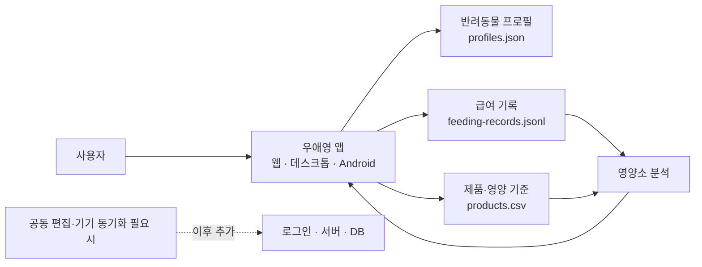

# 우애영

반려동물의 식단을 간단히 기록하고 영양 정보를 확인하는 서비스입니다.

## 핵심 기능

- 반려동물 프로필과 하루 급여량을 기록합니다.
- 사료·간식·영양제를 조합하고 영양소 총량을 확인합니다.
- 급여 기록을 날짜별로 쌓고, 필요하면 파일로 내보냅니다.
- 보호소에서는 동물·케이지·급여 현황을 한 화면에서 확인합니다.

## 기록과 이용 방식

초기 버전은 DB와 회원가입 없이 사용할 수 있습니다. 반려동물 정보와 설정은 로컬 JSON 파일에 저장하고, 급여 기록은 한 줄에 한 건씩 추가되는 JSONL 또는 CSV 파일로 관리합니다. 새 기록을 추가해도 이전 기록은 그대로 남아 날짜별 이력을 확인할 수 있습니다.

로그인 없이 같은 기기에서 바로 시작할 수 있습니다. 여러 사람이 같은 기록을 함께 수정하거나 여러 기기에서 동기화해야 할 때 로그인과 DB를 추가합니다.

## 아키텍처

앱은 기기 안의 파일을 읽고, 새 급여 기록은 JSONL 또는 CSV 파일 끝에 추가합니다. 초기 버전은 서버·DB·로그인 없이 동작하며, 공유와 동기화가 필요한 시점에만 서버 저장소를 연결합니다.

## 운영 흐름

`프로필 입력` → `급여 기록 추가` → `영양소 분석` → `파일에 이력 저장`

기록 파일은 다른 기기로 옮기거나 백업할 수 있습니다. 공동 운영·동기화가 필요해지면 로그인과 서버 저장소를 연결합니다.

## 배포

- 웹 앱: React + Vite
- 설치형 앱: Electron + PyInstaller + electron-builder
- Android 앱: Capacitor
- 기록 파일: JSON·JSONL·CSV

## 프로젝트

- [우애영 GitHub 조직](https://github.com/WooAeyoung)
- [전체 저장소 목록](https://github.com/orgs/WooAeyoung/repositories)
- [우애영 소스 코드 — 웹·앱·백엔드](https://github.com/WooAeyoung/backend)
- [프런트엔드 — React 웹·Android 앱](https://github.com/WooAeyoung/Frontend)

> 현재 영양 기준·제품·가격 데이터는 기능 검증용 데모입니다. 실제 급여 판단이나 수의학적 처방을 대체하지 않습니다.
