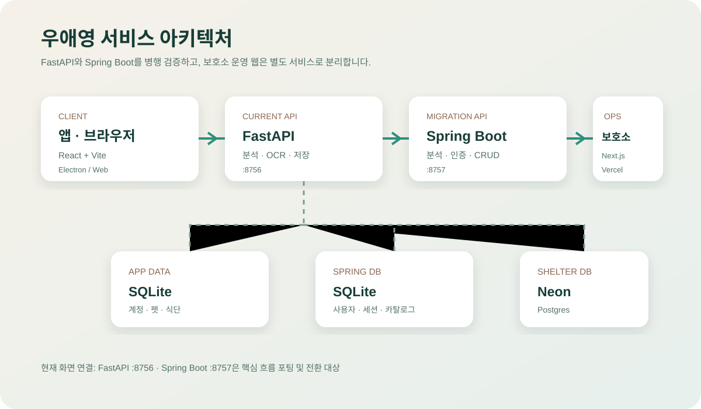
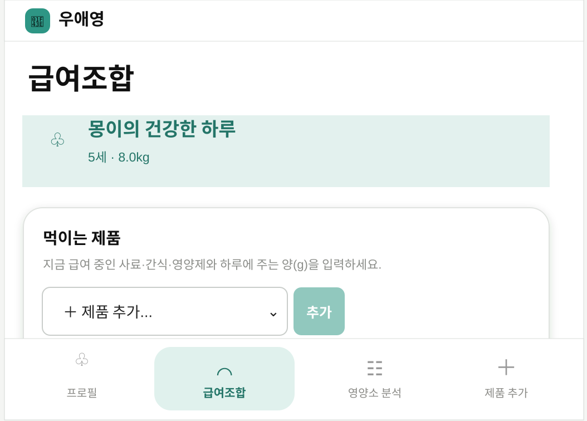
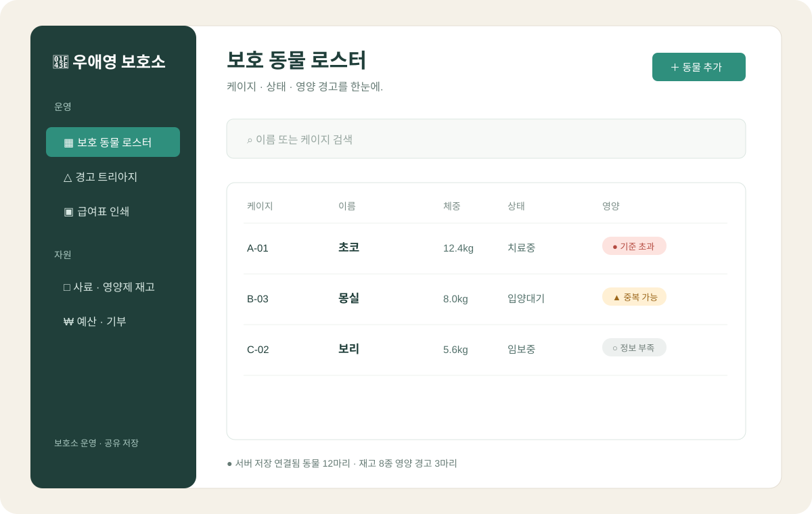

# 우애영

반려동물의 식단과 보호소 운영을 더 명확하고 안전하게 만드는 서비스를 만듭니다.

## 한눈에 보기

| 서비스 | 용도 | 기술 |
| --- | --- | --- |
| **우애영 앱** | 반려동물 급여조합·영양소 분석 | React + Vite, Electron, FastAPI |
| **Spring Boot 백엔드** | 핵심 분석·인증·펫·제품·식단 API 이식 | Java, Spring Boot, SQLite |
| **우애영 보호소** | 로스터·영양 경고·급여표·재고·예산 | Next.js, Vercel, Neon Postgres |

## 아키텍처

우애영 앱은 브라우저에서 실행할 수 있고 Electron 데스크톱 창으로도 패키징됩니다. 현재 기본 분석 API는 FastAPI `:8756`이며, Spring Boot `:8757`은 핵심 흐름을 이식해 검증하고 있는 전환 백엔드입니다. 보호소 운영 웹은 별도 Next.js 서비스로 Vercel에 배포합니다.

## 우애영 앱 화면

실제 앱 흐름은 다음과 같습니다.

`프로필` → `급여조합` → `영양소 분석` → `제품 추가`

여러 제품의 하루 급여량을 합산하고, 영양소별 총량·참고 범위·정보 누락·확인 필요 신호를 표시합니다.

## 보호소 웹 화면

보호소 직원은 접근 키로 로그인한 뒤 다음 운영 화면을 사용합니다.

`보호 동물 로스터` · `경고 트리아지` · `급여표 인쇄` · `사료 재고` · `예산·기부` · `설정`

## 배포

- 브라우저 앱: FastAPI 서버가 정적 프론트엔드와 API를 함께 제공
- 설치형 앱: Electron + PyInstaller + electron-builder
- 보호소 웹: Vercel 프로젝트 `shelter`, Neon Postgres 저장소
- 임시 공유: Cloudflare Tunnel

## 프로젝트

- [조직 저장소](https://github.com/WooAeyoung)
- [백엔드 저장소](https://github.com/WooAeyoung/backend)

> 현재 영양 기준·제품·가격 데이터는 기능 검증용 데모입니다. 실제 급여 판단이나 수의학적 처방을 대체하지 않습니다.
