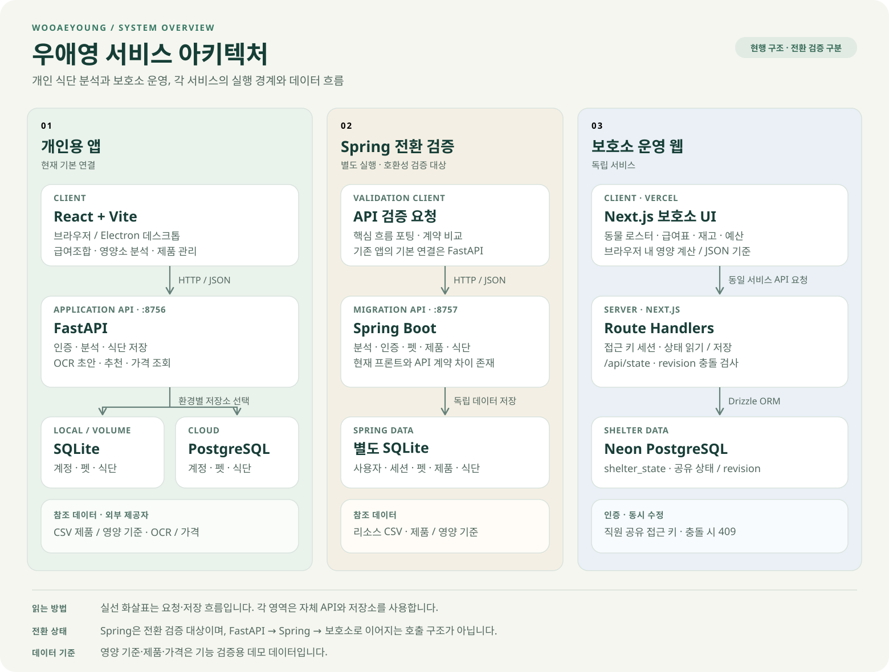

# 우애영

반려동물의 식단과 보호소 운영을 더 명확하고 안전하게 만드는 서비스를 만듭니다.

## 서비스 구성

| 서비스 | 용도 | 기술 |
| --- | --- | --- |
| **우애영 웹 앱** | 급여조합·영양소 분석 | React + Vite, FastAPI |
| **우애영 설치형 앱** | 같은 화면을 데스크톱으로 패키징 | Electron, PyInstaller |
| **우애영 Android 앱** | 배포된 웹 서비스에 연결하는 모바일 앱 | Capacitor, Android |
| **Spring Boot 백엔드** | 핵심 분석·인증·펫·제품·식단 API | Java, Spring Boot, SQLite |
| **우애영 보호소** | 로스터·경고·급여표·재고·예산 | Next.js, Vercel, Neon Postgres |

## 아키텍처

세 영역은 각자의 API와 저장소를 사용합니다. 그림의 실선은 요청·저장 흐름을 나타냅니다.

- **개인용 앱**: React + Vite 화면을 브라우저와 Electron에서 사용하며, Android 앱은 Capacitor로 배포된 HTTPS 서비스에 연결합니다. 기본 로컬 API는 FastAPI `:8756`입니다. 로컬·영속 볼륨 환경에서는 SQLite, 클라우드 구성에서는 PostgreSQL을 사용합니다.
- **Spring 전환 검증**: Spring Boot `:8757`은 핵심 기능을 이식한 별도 구현입니다. 독립 SQLite와 리소스 CSV를 사용하며, 기존 프론트와의 API 호환성을 검증하는 대상입니다.
- **보호소 운영 웹**: Vercel의 Next.js 앱이 자체 Route Handlers와 Neon PostgreSQL로 상태를 저장합니다. 영양 계산은 브라우저의 TypeScript와 JSON 기준 데이터로 수행합니다.

개인용 앱과 Spring은 제품·영양 기준 CSV를 참조합니다. 보호소는 공유 접근 키로 인증하고, `revision`으로 동시 수정 충돌을 감지합니다.

## 주요 화면

<table>
<tr>
<td width="25%" align="center"></td>
<td width="25%" align="center"></td>
<td width="25%" align="center"></td>
<td width="25%" align="center"></td>
</tr>
<tr>
<td align="center"><b>로그인</b> 이메일 계정으로 시작합니다.</td>
<td align="center"><b>급여조합</b> 사료·간식·영양제와 하루 급여량을 관리합니다.</td>
<td align="center"><b>영양소 분석</b> 총량과 참고 범위, 확인 필요 신호를 보여줍니다.</td>
<td align="center"><b>보호소 로스터</b> 동물·케이지·상태·영양 경고를 관리합니다.</td>
</tr>
</table>

## 운영 흐름

`프로필` → `급여조합` → `영양소 분석` → `제품 추가`

보호소 직원은 접근 키로 로그인한 뒤 `보호 동물 로스터` · `경고 트리아지` · `급여표 인쇄` · `사료 재고` · `예산·기부`를 사용합니다.

## 배포

- 웹 앱: FastAPI 서버가 정적 프론트엔드와 API를 함께 제공하며, Vercel + PostgreSQL 배포 구성을 지원
- 설치형 앱: Electron + PyInstaller + electron-builder
- Android 앱: Capacitor 기반으로 배포된 HTTPS 웹 서비스에 연결
- 보호소 웹: Vercel 프로젝트 `shelter`, Neon Postgres 저장소
- 임시 공유: Cloudflare Tunnel

## 프로젝트

- [우애영 GitHub 조직](https://github.com/WooAeyoung)
- [전체 저장소 목록](https://github.com/orgs/WooAeyoung/repositories)
- [우애영 소스 코드 — 웹·앱·백엔드](https://github.com/WooAeyoung/backend)
- [프런트엔드 — React 웹·Android 앱](https://github.com/WooAeyoung/backend/tree/main/frontend)

> 현재 영양 기준·제품·가격 데이터는 기능 검증용 데모입니다. 실제 급여 판단이나 수의학적 처방을 대체하지 않습니다.
